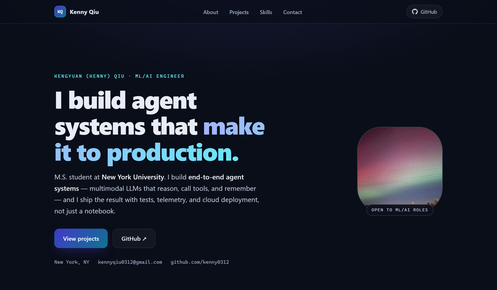

# Kenny Qiu — personal site

### [▶&nbsp;&nbsp;kenny0312.github.io](https://kenny0312.github.io)

ML/AI engineer · I build agent systems that make it to production.

  

 

One hand-built HTML file — no frameworks, no build step, no trackers. Push to `main` and GitHub Pages ships it.

**Editing:** everything lives in [`index.html`](index.html). One placeholder remains, marked with an `EDIT-ME` comment — the degree line in the About section.

 

See also: <a href="https://github.com/kenny0312/social-video-insights">SocialLens</a> — a social-video insights demo · <a href="https://github.com/kenny0312/videosense-agent">VideoSense Agent</a> — a conversational agent over your video library

